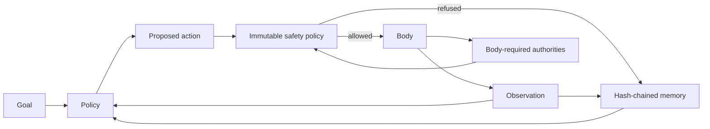

# Mira Core architecture

`mira_core` is the first reusable operational package in Mira Genesis. The historical
`metamorphosis` package remains the scientific record of particular experiments; the new package
provides contracts future terminal, browser, simulator and device bodies can share.

## Runtime flow

The policy may be symbolic, learned or backed by a future foundation model. The core does not
silently choose a provider and does not treat model output as authority.

`StructuredModelPolicy` now supplies the provider-neutral model boundary. It validates one closed
JSON decision and maps it to a fixed body action; malformed output and backend exceptions become
fail-closed evidence. `CodexExecBackend` is one explicit adapter, not a hidden default.

## Contracts

- `Goal` carries a stable identifier, instruction and machine-readable success criteria.
- `Action` carries a kind, payload and explicit authority requirements.
- `Observation` carries environment state and evaluator-owned terminal/success flags.
- `Body` resets an episode and executes admitted actions.
- `AuthorityAwareBody` declares the minimum authority for each action independently of the policy.
- `Policy` proposes an action or explicitly refuses.

Success belongs to the body/evaluator boundary, never to the policy's self-report.

## Safety boundary

The default `SafetyPolicy` grants compute and ephemeral memory only. Filesystem changes, network,
repository writes, credentials, deployment, permission changes and physical actuation are absent.
Even if a high-impact authority is placed in a policy object, it remains blocked until a separate
authenticated human-release mechanism exists. An agent can reduce authority for a descendant but
cannot expand its own immutable set.

Before admission, `MiraAgent` compares an authority-aware body's requirement with the action's own
declaration. Under-declaration and broken body contracts fail closed before the body executes.

## Governed terminal body

`GovernedTerminalBody` acts on a resolved real directory. It supports bounded listing, UTF-8 reads,
atomic UTF-8 writes and immutable evaluator-registered commands. Paths cannot be absolute, contain
parent traversal or cross symlinks. Policies select command identifiers only; they cannot provide
arguments or shell syntax. Child processes receive a minimal environment, closed stdin, combined
bounded output and a timeout.

These are application-level affordance controls. Registered commands are trusted host code and are
not confined by an OS security boundary. Use an independently configured container or VM before
registering untrusted executables.

## Isolated container body

`IsolatedContainerBody` crosses that engineering boundary for untrusted task commands. It accepts
only digest-pinned images and starts a disposable Docker container with no network, no Linux
capabilities, `no-new-privileges`, a read-only root filesystem and fixed CPU, memory, PID, time,
step, script and output budgets. The only host mount is a disposable task directory; neither the
repository nor Docker socket is exposed.

The body inspects Docker's realized configuration after creation and removes the container if any
security invariant differs. A model can execute one bounded script or submit the workspace, but
submission never marks success. An external evaluator owns the final-state verdict.

## Evidence and recovery

Every episode appends canonical events to `MemoryLedger`. Each digest binds the event index, kind,
payload and previous digest. Checkpoints restore the complete chain exactly; payload, ordering,
link or head-digest tampering fails validation.

The agent records starts, admissions, observations, refusals, policy/backend errors, body reset or
action errors, budget exhaustion and termination. Failures become evidence rather than disappearing
behind a generic exception.

## Current limits

This is an engineering foundation, not a general cognitive system. It currently provides no:

- built-in language or multimodal model (one explicit external Codex adapter exists);
- planner or learned world model;
- semantic retrieval system;
- online parameter learning;
- browser or physical body;
- independent adversarial validation of the Docker isolation boundary;
- authenticated high-impact release service.

Those features must be added behind the existing body, policy, memory and safety boundaries and
evaluated against `MIRA_GENERALITY_CRITERIA.md`.
