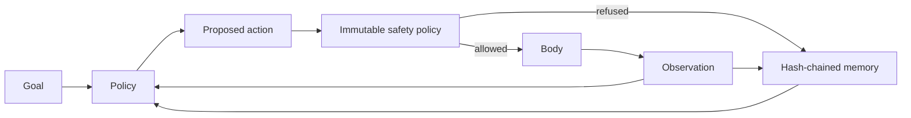

# Mira Core architecture

`mira_core` is the first reusable operational package in Mira Genesis. The historical
`metamorphosis` package remains the scientific record of particular experiments; the new package
provides contracts future terminal, browser, simulator and device bodies can share.

## Runtime flow

The policy may be symbolic, learned or backed by a future foundation model. The core does not
silently choose a provider and does not treat model output as authority.

## Contracts

- `Goal` carries a stable identifier, instruction and machine-readable success criteria.
- `Action` carries a kind, payload and explicit authority requirements.
- `Observation` carries environment state and evaluator-owned terminal/success flags.
- `Body` resets an episode and executes admitted actions.
- `Policy` proposes an action or explicitly refuses.

Success belongs to the body/evaluator boundary, never to the policy's self-report.

## Safety boundary

The default `SafetyPolicy` grants compute and ephemeral memory only. Filesystem changes, network,
repository writes, credentials, deployment, permission changes and physical actuation are absent.
Even if a high-impact authority is placed in a policy object, it remains blocked until a separate
authenticated human-release mechanism exists. An agent can reduce authority for a descendant but
cannot expand its own immutable set.

## Evidence and recovery

Every episode appends canonical events to `MemoryLedger`. Each digest binds the event index, kind,
payload and previous digest. Checkpoints restore the complete chain exactly; payload, ordering,
link or head-digest tampering fails validation.

The agent records starts, admissions, observations, refusals, body errors, budget exhaustion and
termination. Body exceptions become evidence rather than disappearing behind a generic failure.

## Current limits

This is an engineering foundation, not a general cognitive system. It currently provides no:

- language or multimodal model;
- planner or learned world model;
- semantic retrieval system;
- online parameter learning;
- terminal, browser or physical body;
- authenticated high-impact release service.

Those features must be added behind the existing body, policy, memory and safety boundaries and
evaluated against `MIRA_GENERALITY_CRITERIA.md`.
